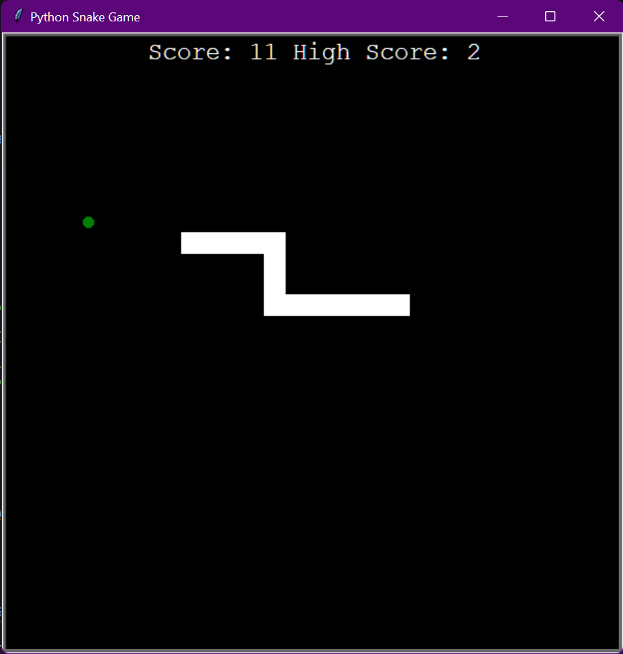

# Snake

This project is a basic implementation of Snake using Python's Turtle graphics. This project was created in order to practice core concepts in object-oriented programming.

To run the game, clone the repository and open `main.py` using python. Control the snake using the keyboard's arrow keys.

**There is currently a bug where pressing the arrows keys too quickly will result in the snake not turning. You can also kill the snake by accident if you press left + right or up + down too quickly, as the game will interpret this as the snake turning into itself.**
